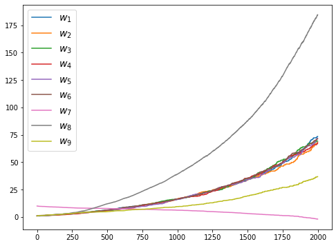

# Exercises - Chapter 11

Carl Fredriksson, c@msp.se

## Exercise 11.1

Convert the equation of $n$-step off-policy TD (7.9) to semi-gradient form. Give accompanying definitions of the return for both the episodic and continuing cases.

**My answer:**

$$
\begin{aligned}
\textbf{w}_{t+n} \overset{.}{=} \textbf{w}_{t+n-1} + \alpha \rho_{t:t+n-1} \big[G_{t:t+n} - \hat{v}(S_t,\textbf{w}_{t+n-1})\big] \nabla \hat{v}(S_t,\textbf{w}_{t+n-1})
\end{aligned}
$$

If episodic: $\rho_k = 1$ for all $k \geq T$ (where $T$ is the last step of the episode).

Episodic return:

$$
\begin{aligned}
G_{t:t+n} \overset{.}{=} R_{t+1} + \dots + \gamma^{n-1} R_{t+n} + \gamma^n \hat{v}(S_{t+n},\textbf{w}_{t+n-1})
\end{aligned}
$$

with $G_{t:t+n} = G_t$ if $t+n \geq T$.

Continuing return:

$$
\begin{aligned}
G_{t:t+n} \overset{.}{=} R_{t+1} - \={R}_t + \dots + R_{t+n} - \={R}_{t+n-1} + \hat{v}(S_{t+n},\textbf{w}_{t+n-1})
\end{aligned}
$$

## Exercise 11.2

Convert the equations of $n$-step $Q(\sigma)$ (7.11 and 7.17) to semi-gradient form. Give definitions that cover both the episodic and continuing cases.

**My answer:**

From section 7.6:

>Then we use the earlier update for $n$-step Sarsa without importance-sampling ratios (7.5) instead of (7.11), because now the ratios are incorporated in the $n$-step return.

I believe the exercise description is wrong and it should be (7.5 and 7.17) rather than (7.11 and 7.17). Let $h=t+n$, we have

$$
\begin{aligned}
\textbf{w}_h \overset{.}{=} \textbf{w}_{h-1} + \alpha \big[G_{t:h} - \hat{q}(S_t,A_t,\textbf{w}_{h-1})\big] \nabla \hat{q}(S_t,A_t,\textbf{w}_{h-1})
\end{aligned}
$$

If episodic: $\rho_k = 1$ for all $k \geq T$ (where $T$ is the last step of the episode).

Episodic return:

$$
\begin{aligned}
G_{t:h} \overset{.}{=} R_{t+1} + \gamma \bigg(\sigma_{t+1}\rho_{t+1} + (1-\sigma_{t+1}) \pi(A_{t+1}|S_{t+1}) \bigg) \bigg(G_{t+1:h} - \hat{q}(S_{t+1},A_{t+1},\textbf{w}_{h-1}) \bigg) + \gamma \sum_a \pi(a|S_{t+1}) \hat{q}(S_{t+1},a,\textbf{w}_{h-1})
\end{aligned}
$$

for $t < h \leq T$. The recursion ends with $G_{h:h} \overset{.}{=} \hat{q}(S_h,A_h,\textbf{w}_{h-1})$ if $h<T$, or with $G_{T-1:T} \overset{.}{=} R_T$ if $h=T$.

Continuing return:

$$
\begin{aligned}
G_{t:h} \overset{.}{=} R_{t+1} - \={R}_t + \bigg(\sigma_{t+1}\rho_{t+1} + (1-\sigma_{t+1}) \pi(A_{t+1}|S_{t+1}) \bigg) \bigg(G_{t+1:h} - \hat{q}(S_{t+1},A_{t+1},\textbf{w}_{h-1}) \bigg) + \sum_a \pi(a|S_{t+1}) \hat{q}(S_{t+1},a,\textbf{w}_{h-1})
\end{aligned}
$$

The recursion ends with $G_{h:h} \overset{.}{=} \hat{q}(S_h,A_h,\textbf{w}_{h-1})$.

## Exercise 11.3 (programming)

Apply one-step semi-gradient Q-learning to Baird’s counterexample and show empirically that its weights diverge.

**My answer:**

## Exercise 11.4

Prove (11.24). Hint: Write the $\overline{RE}$ as an expectation over possible states $s$ of the expectation of the squared error given that $S_t=s$. Then add and subtract the true value of state $s$ from the error (before squaring), grouping the subtracted true value with the return and the added true value with the estimated value. Then, if you expand the square, the most complex term will end up being zero, leaving you with (11.24).

**My answer:**

$$
\begin{aligned}
\overline{RE}(\textbf{w}) &= \mathbb{E}\bigg[\big(G_t - \hat{v}(S_t,\textbf{w})\big)^2\bigg] \\
&= \mathbb{E}\bigg[\mathbb{E}\bigg[\big(G_t - \hat{v}(s,\textbf{w})\big)^2 \;|\;S_t=s\bigg]\bigg] \\
&= \sum_{s \in \mathcal{S}} \mu(s) \mathbb{E}\bigg[\big([G_t - v_\pi(s)] + [v_\pi(s) - \hat{v}(s,\textbf{w})]\big)^2 \;|\;S_t=s\bigg] \\
&= \sum_{s \in \mathcal{S}} \mu(s) \mathbb{E}\bigg[\big(G_t - v_\pi(s)\big)^2 + 2\big(G_t - v_\pi(s)\big)\big(v_\pi(s) - \hat{v}(s,\textbf{w})\big) + \big(v_\pi(s) - \hat{v}(s,\textbf{w})\big)^2 \;|\;S_t=s\bigg] \\
&= \overline{VE}(\textbf{w}) + \mathbb{E}\bigg[\big(G_t - v_\pi(S_t)\big)^2\bigg] + 2 \sum_{s \in \mathcal{S}} \mu(s) \mathbb{E}\bigg[G_t v_\pi(s) - G_t \hat{v}(s,\textbf{w}) - v_\pi(s)^2 + v_\pi(s) \hat{v}(s,\textbf{w}) \;|\;S_t=s\bigg] \\
&= \overline{VE}(\textbf{w}) + \mathbb{E}\bigg[\big(G_t - v_\pi(S_t)\big)^2\bigg] + 2 \sum_{s \in \mathcal{S}} \mu(s) \bigg[v_\pi(s)^2 - v_\pi(s) \hat{v}(s,\textbf{w}) - v_\pi(s)^2 + v_\pi(s) \hat{v}(s,\textbf{w})\bigg] \\
&= \overline{VE}(\textbf{w}) + \mathbb{E}\bigg[\big(G_t - v_\pi(S_t)\big)^2\bigg]
\end{aligned}
$$
