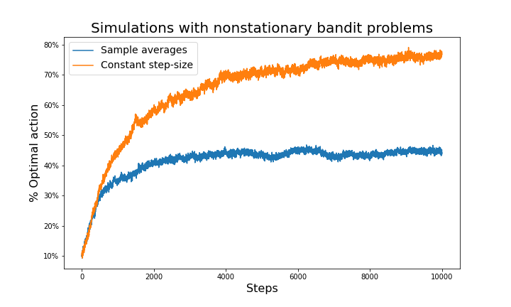
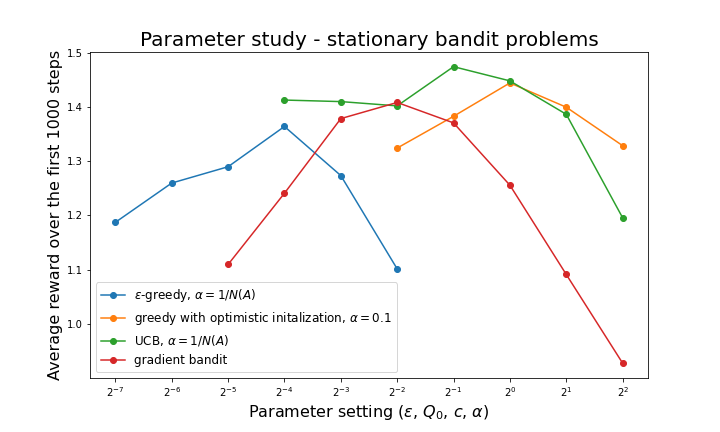
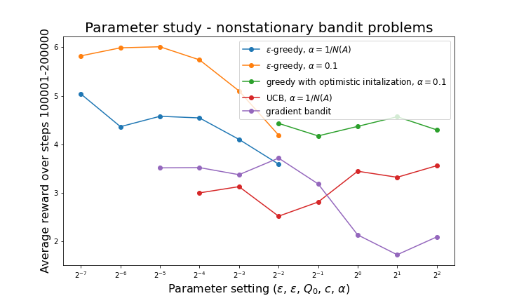

# Exercises - Chapter 2

Carl Fredriksson, c@msp.se

## Exercise 2.1 

In $\epsilon$-greedy action selection, for the case of two actions and $\epsilon = 0.5$, what is the probability that the greedy action is selected?

**My answer:**

Let $n_a$ be the number of actions. Any any time step we can either explore or exploit. The probability of selecting the greedy action is:

$$
\begin{equation}
\begin{split}
P(\textit{select greedy action}) &= P(exploit)P(\textit{select greedy action} | exploit) + P(explore)P(\textit{select greedy action} | explore) \\
&= (1 - \epsilon) \cdot 1 + \epsilon \cdot \frac{1}{n_a} \\
&= 0.5 + 0.5 \cdot 0.5 \\
&= 0.75
\end{split}
\end{equation}
$$

## Exercise 2.2: Bandit example

Consider a $k$-armed bandit problem with $k = 4$ actions, denoted 1, 2, 3, and 4. Consider applying to this problem a bandit algorithm using $\epsilon$-greedy action selection, sample-average action-value estimates, and initial estimates of $Q_1(a) = 0$, for all $a$. Suppose the initial sequence of actions and rewards is $A_1 = 1$, $R_1 = 1$, $A_2 = 2$, $R_2 = 1$, $A_3 = 2$, $R_3 = 2$, $A_4 = 2$, $R_4 = 2$, $A_5 = 3$, $R_5 = 0$. On some of these time steps the $\epsilon$ case may have occurred, causing an action to be selected at random. On which time steps did this definitely occur? On which time steps could this possibly have occurred?

**My answer:**

|$t$|$A_t$|$R_t$|$Q_t(1)$|$Q_t(2)$|$Q_t(3)$|$Q_t(4)$|$\epsilon$ case|
|:-:|:---:|:---:|:------:|:------:|:------:|:------:|:-------------:|
| 0 |  -  |  -  |   0    |   0    |   0    |   0    |       -       |
| 1 |  1  |  1  |   1    |   0    |   0    |   0    |    possibly   |
| 2 |  2  |  1  |   1    |   1    |   0    |   0    |      yes      |
| 3 |  2  |  2  |   1    |   3/2  |   0    |   0    |    possibly   |
| 4 |  2  |  2  |   1    |   5/3  |   0    |   0    |    possibly   |
| 5 |  3  |  0  |   1    |   5/3  |   0    |   0    |      yes      |

## Exercise 2.3

In the comparison shown in Figure 2.2, which method will perform best in the long run in terms of cumulative reward and probability of selecting the best action? How much better will it be? Express your answer quantitatively.

**My answer:**

In the long run, both $\epsilon$-greedy methods will have found the optimal action and the only difference between the two will be the frequency of exploration. The method with $\epsilon = 0.01$ will outperform the method with $\epsilon = 0.1$ due to selecting the optimal action 99% of the time compared to 90% of the time. It will be 10% better since $0.99/0.9 = 1.1$.

## Exercise 2.4

If the step-size parameters, $\alpha{_n}$, are not constant, then the estimate $Q_n$ is a weighted average of previously received rewards with a weighting different from that given by (2.6). What is the weighting on each prior reward for the general case, analogous to (2.6), in terms of the sequence of step-size parameters?

**My answer:**

$$
\begin{equation}
\begin{split}
Q_{n+1} &= Q_n + \alpha_n (R_n - Q_n) \\
&= \alpha_n R_n + (1 - \alpha_n) Q_n \\
&= \alpha_n R_n + (1 - \alpha_n) (\alpha_{n-1} R_{n-1} + [1 - \alpha_{n-1}] Q_{n-1}) \\
&= \alpha_n R_n + (1 - \alpha_n) \alpha_{n-1} R_{n-1} + (1 - \alpha_n) (1 - \alpha_{n-1}) Q_{n-1} \\
&= \alpha_n R_n + (1 - \alpha_n) \alpha_{n-1} R_{n-1} + (1 - \alpha_n) (1 - \alpha_{n-1}) \alpha_{n-2} R_{n-2} + \\
&\qquad \dots + \alpha_1 R_1 \prod_{i=2}^{n} (1 - \alpha_i) + Q_1 \prod_{i=1}^{n} (1 - \alpha_i) \\
&= Q_1 \prod_{i=1}^{n} (1 - \alpha_i) + \alpha_n R_n + \sum_{i=1}^{n-1} \big[ \alpha_i R_i \prod_{j=i+1}^{n} (1 - \alpha_j) \big]
\end{split}
\end{equation}
$$

## Exercise 2.5 (programming)

Design and conduct an experiment to demonstrate the diculties that sample-average methods have for nonstationary problems. Use a modified version of the 10-armed testbed in which all the $q_*(a)$ start out equal and then take independent random walks (say by adding a normally distributed increment with mean 0 and standard deviation 0.01 to all the $q_*(a)$ on each step). Prepare plots like Figure 2.2 for an action-value method using sample averages, incrementally computed, and another action-value method using a constant step-size parameter, $\alpha = 0.1$. Use $\epsilon = 0.1$ and longer runs, say of 10,000 steps.

**My answer:**

I programmed the exercise in a way that makes it easy to run simulations for both stationary and nonstationary bandit problems. The stationary plots are almost identical to the ones in the book (Figure 2.2), which is a good indication that the code works.

In the plots for the nonstationary bandit problems we can see that the action-value method using a constant step-size outperforms the method using sample averages. This is due to it being better at adapting to the changing action-values since it weighs recent rewards more strongly.

## Exercise 2.6: Mysterious Spikes

The results shown in Figure 2.3 should be quite reliable because they are averages over 2000 individual, randomly chosen 10-armed bandit tasks. Why, then, are there oscillations and spikes in the early part of the curve for the optimistic method? In other words, what might make this method perform particularly better or worse, on average, on particular early steps?

**My answer:**

I believe it performs better on average right after having tried all actions once, which is almost guaranteed to happen in the first 10 (number of bandit arms) steps. It's almost guaranteed since it's incredibly likely that the reward received from any action will be below our optimistic inital action-value estimate. Any reward below the initial estimate will reduce the estimate for the selected action and lead to that action not being selected again until all other actions have been selected at least once - due to the greedy action selection. The best action is the most likely to have reduced its optimistic initial action-value estimate the least after all actions have been tried once and is thus the action that is the most likely to be selected at the next step. Since there are 9 other actions and the rewards are non-deterministic, picking the optimal action is not a guarantee. In this example, picking a suboptimal action is more likely (with about 60% probability judging from the results).

## Exercise 2.7: Unbiased Constant-Step-Size Trick

In most of this chapter we have used sample averages to estimate action values because sample averages do not produce the initial bias that constant step sizes do (see the analysis leading to (2.6)). However, sample averages are not a completely satisfactory solution because they may perform poorly on nonstationary problems. Is it possible to avoid the bias of constant step sizes while retaining their advantages on nonstationary problems? One way is to use a step size of

$$
\beta_n \; \dot{=} \; \alpha / \={\omicron}_n ,
$$

to process the $n$th reward for a particular action, where $\alpha > 0$ is a conventional constant step size, and $\={\omicron}_n$ is a trace of one that starts at 0:

$$
\={\omicron}_n \; \dot{=} \; \={\omicron}_{n-1} + \alpha (1 - \={\omicron}_{n-1}), \quad \text{for} \; n > 0, \quad \text{with} \; \={\omicron}_0 \; \dot{=} \; 0
$$

Carry out an analysis like that in (2.6) to show that $Q_n$ is an exponential recency-weighted average *without initial bias*.

**My answer:**

$$
\begin{equation}
\begin{split}
Q_{n+1} &= Q_n + \beta_n (R_n - Q_n) \\
&= \beta_n R_n + (1 - \beta_n) Q_n \\
&= \beta_n R_n + (1 - \beta_n) (\beta_{n-1} R_{n-1} + [1 - \beta_{n-1}] Q_{n-1}) \\
&= \beta_n R_n + (1 - \beta_n) \beta_{n-1} R_{n-1} + (1 - \beta_n) (1 - \beta_{n-1}) Q_{n-1} \\
&= \beta_n R_n + (1 - \beta_n) \beta_{n-1} R_{n-1} + (1 - \beta_n) (1 - \beta_{n-1}) \beta_{n-2} R_{n-2} + \\
&\qquad \dots + \beta_1 R_1 \prod_{i=2}^{n} (1 - \beta_i) + Q_1 \prod_{i=1}^{n} (1 - \beta_i) \\
&= Q_1 \prod_{i=1}^{n} (1 - \beta_i) + \beta_n R_n + \sum_{i=1}^{n-1} \big[ \beta_i R_i \prod_{j=i+1}^{n} (1 - \beta_j) \big]
\end{split}
\end{equation}
$$

To show that $Q_n$ is without initial bias, we need to show that $\prod_{i=1}^{n} (1 - \beta_i) = 0$.

$$
\begin{equation}
\begin{split}
\prod_{i=1}^{n} (1 - \beta_i) &= (1 - \beta_1) \prod_{i=2}^{n} (1 - \beta_i) \\
&= (1 - \frac{\alpha}{\=\omicron_1}) \prod_{i=2}^{n} (1 - \beta_i) \\
&= (1 - \frac{\alpha}{\=\omicron_0 + \alpha(1 - \=\omicron_0)}) \prod_{i=2}^{n} (1 - \beta_i) \\
&= (1 - \frac{\alpha}{\alpha}) \prod_{i=2}^{n} (1 - \beta_i) \\
&= 0
\end{split}
\end{equation}
$$

Thus $Q_n$ is without initial bias. To show that $Q_n$ is exponentially recency-weighted, we need to show that the weight for $R_i$, which is $\beta_i \prod_{j=i+1}^{n} (1 - \beta_j)$, exponentially decreases the more rewards ago $R_i$ was observed.

$$
\begin{equation}
\begin{split}
\={\omicron}_n  &= \={\omicron}_{n-1} + \alpha (1 - \={\omicron}_{n-1}) \\
&= \alpha + (1 - \alpha) \={\omicron}_{n-1} \\
&= \alpha + (1 - \alpha) (\alpha + [1 - \alpha] \={\omicron}_{n-2}) \\
&= \alpha + \alpha (1 - \alpha) + (1 - \alpha)^2 (\alpha + [1 - \alpha] \={\omicron}_{n-3}) \\
&= \alpha + \alpha (1 - \alpha) + (1 - \alpha)^2 + \dots + (1 - \alpha)^{n-1} + (1 - \alpha)^n \={\omicron}_0 \\
&= \alpha + \alpha (1 - \alpha) + (1 - \alpha)^2 + \dots + (1 - \alpha)^{n-1} \\
&= \alpha (1 + \sum_{i=1}^{n-1} [1 - \alpha]^i)
\end{split}
\end{equation}
$$

$$
\begin{equation}
\begin{split}
\beta_n &= \frac{\alpha}{\={\omicron}_n} \\
&= \frac{\alpha}{\alpha (1 + \sum_{i=1}^{n-1} [1 - \alpha]^i)} \\
&= \frac{1}{1 + \sum_{i=1}^{n-1} [1 - \alpha]^i} \\
\end{split}
\end{equation}
$$

Thus $\alpha \in (0, 1] \implies B_n \in (0, 1] \implies 1 - B_n \in [0, 1)$, which means that $\beta_i \prod_{j=i+1}^{n} (1 - \beta_j)$ exponentially decreases the more rewards ago $R_i$ was observed, and thus $Q_n$ is exponentially recency-weighted.

## Exercise 2.8: UCB Spikes

In Figure 2.4 the UCB algorithm shows a distinct spike in performance on the 11th step. Why is this? Note that for your answer to be fully satisfactory it must explain both why the reward increases on the 11th step and why it decreases on the subsequent steps. Hint: If $c = 1$, then the spike is less prominent.

**My answer:**

This question and answer is similar to Exercise 2.6: Mysterious Spikes. All 10 actions will be tried in the first 10 time steps. On the 11th step, the action that resulted in the highest reward on its first try will be selected since every action will have the same uncertainty term $\sqrt{\frac{\ln 11}{1}}$, which leads to increased performance for that step. On the subsequent steps, the uncertainty term will play a big role and many exploratory actions will be taken, thus we see a decrease in performance. With $c = 1$, the uncertainty term plays a smaller role and greedy selection is more likely - which makes the spike less prominent. Over time, the impact of the uncertainty term decreases and the action-value estimates will be increasingly accurate - this leads to increased performance over time.

## Exercise 2.9

Show that in the case of two actions, the soft-max distribution is the same as that given by the logistic, or sigmoid, function often used in statistics and artificial neural networks.

**My answer:**

The sigmoid function is defined as:

$$
\sigma(x) = \frac{1}{1 + e^{-x}}
$$

In the case of two actions $\{a, b\}$, the soft-max distribution becomes:

$$
\text{Pr}(A_t = a) = \frac{e^{H_t(a)}}{e^{H_t(a)} + e^{H_t(b)}}
$$

$$
\text{Pr}(A_t = b) = \frac{e^{H_t(b)}}{e^{H_t(a)} + e^{H_t(b)}}
$$

However, since the probabilities of all possible outcomes must sum to 1, we have $\text{Pr}(A_t = a) = 1 - \text{Pr}(A_t = b)$. In other words, we only have 1 degree of freedom, since knowing the probability for one action gives the probability of the other. One way to see that this is the case, is to add a constant $C$ to both numerical preferences, as this does not change the equations:

$$
\begin{equation}
\begin{split}
\frac{e^{H_t(a)+C}}{e^{H_t(a)+C} + e^{H_t(b)+C}} = \frac{e^C e^{H_t(a)}}{e^C (e^{H_t(a)} + e^{H_t(b)})} = \frac{e^{H_t(a)}}{e^{H_t(a)} + e^{H_t(b)}}
\end{split}
\end{equation}
$$

We can choose $C = -H_t(b)$ and define new numerical preferences $H_t^\prime(a) = H_t(a) + C = H_t(a) - H_t(b)$, and $H_t^\prime(b) = H_t(b) + C = H_t(b) - H_t(b) = 0$. This gives us:

$$
\text{Pr}(A_t = a) = \frac{e^{H_t^\prime(a)}}{e^{H_t^\prime(a)} + e^{H_t^\prime(b)}} = \frac{e^{H_t^\prime(a)}}{e^{H_t^\prime(a)} + 1} = \frac{1}{1 + e^{-H_t^\prime(a)}} = \sigma(H_t^\prime(a))
$$

$$
\text{Pr}(A_t = b) = \frac{e^{H_t^\prime(b)}}{e^{H_t^\prime(a)} + e^{H_t^\prime(b)}} = \frac{1}{e^{H_t^\prime(a)} + 1}
$$

$$
1 - \text{Pr}(A_t = a) = 1 - \frac{1}{1 + e^{-H_t^\prime(a)}} = \frac{e^{-H_t^\prime(a)}}{1 + e^{-H_t^\prime(a)}} = \frac{1}{e^{H_t^\prime(a)} + 1} = \text{Pr}(A_t = b)
$$

Thus, in the case of two actions, the soft-max distribution is the same as that given by the sigmoid function.

## Exercise 2.10

Suppose you face a 2-armed bandit task whose true action values change randomly from time step to time step. Specifically, suppose that, for any time step, the true values of actions 1 and 2 are respectively 10 and 20 with probability 0.5 (case A), and 90 and 80 with probability 0.5 (case B). If you are not able to tell which case you face at any step, what is the best expected reward you can achieve and how should you behave to achieve it? Now suppose that on each step you are told whether you are facing case A or case B (although you still don’t know the true action values). This is an associative search task. What is the best expected reward you can achieve in this task, and how should you behave to achieve it?

**My answer:**

If you are not able to tell which case you face, the best and only expected reward is $0.5 * 10 + 0.5 * 90 = 0.5 * 20 + 0.5 * 80 = 50$, and it doesn't matter how actions are selected. If you are told which case you are facing each step but you don't know the true action values, then you can use one of the methods in this chapter applied separately per case (preferably one that reduces exploration to 0 over time). The best expected reward is $0.5 * 20 + 0.5 * 90 = 55$, which happens when the agent has learned to always select action 2 for case A and action 1 for case B.

## Exercise 2.11 (programming)

Make a figure analogous to Figure 2.6 for the nonstationary case outlined in Exercise 2.5. Include the constant-step-size $\epsilon$-greedy algorithm with $\alpha = 0.1$. Use runs of 200,000 steps and, as a performance measure for each algorithm and parameter setting, use the average reward over the last 100,000 steps. 

**My answer:**

To validate my code, I started by recreating the parameter study in Figure 2.6 from the book. The results were averaged over 1000 runs (the total run time was about 6m 40s on my computer).

Below is the parameter study the exercise asks for. The results were averaged over 100 runs (the total run time was about 4h 40m on my computer).

