# Exercises - Chapter 4

Carl Fredriksson, c@msp.se

## Exercise 4.1

In Example 4.1, if $\pi$ is the equiprobable random policy, what is $q_\pi(11, down)$? What is $q_\pi(7, down)$?

**My answer:**

$$
\begin{aligned}
q_\pi(11, down) &= \sum_{s^\prime, r} p(s^\prime, r | 11, down) \big[r + v_\pi(s^\prime) \big] \\
&= -1 + v_\pi(terminal) \\
&= -1
\end{aligned}
$$

$$
\begin{aligned}
q_\pi(7, down) &= \sum_{s^\prime, r} p(s^\prime, r | 7, down) \big[r + v_\pi(s^\prime) \big] \\
&= -1 + v_\pi(11) \\
&= -15
\end{aligned}
$$

The values for $v_\pi$ can be seen in figure 4.1.

## Exercise 4.2

In Example 4.1, suppose a new state 15 is added to the gridworld just below state 13, and its actions, left, up, right, and down, take the agent to states 12, 13, 14, and 15, respectively. Assume that the transitions from the original states are unchanged. What, then, is $v_\pi(15)$ for the equiprobable random policy? Now suppose the dynamics of state 13 are also changed, such that action down from state 13 takes the agent to the new state 15. What is $v_\pi(15)$ for the equiprobable random policy in this case?

**My answer:**

For the case that the transitions from the original states are unchanged:

$$
\begin{aligned}
v_\pi(15) &= \sum_a \pi(a | 15) \sum_{s^\prime, r} p(s^\prime, r | 15, a) \big[r + v_\pi(s^\prime) \big] \\
&= 0.25 \big[-1 + v_\pi(12) \big] + 0.25 \big[-1 + v_\pi(13) \big] + 0.25 \big[-1 + v_\pi(14) \big] + 0.25 \big[-1 + v_\pi(15) \big] \\
&= -1 + 0.25 \big[-22 - 20 - 14 + v_\pi(15) \big] \\
&= -15 + 0.25 v_\pi(15) \\
&= \frac{-15}{0.75} \\
&= -20
\end{aligned}
$$

For the case where the transitions from state 13 are changed:

I wrote a program implementing iterative policy evaluation for this example. It got the same results as in the book for the original example and validated $v_\pi(15) = -20$ for the case that transitions from the original states are unchanged. When running the program for the case where transitions for state 13 are changed I found that the state values didn't change. This makes sense, since the state values for the next state after selecting an action is identical for state 13 and state 15. Thus we still have:

$$
v_\pi(15) = -20
$$

## Exercise 4.3

What are the equations analogous to (4.3), (4.4), and (4.5), but for action-value functions instead of state-value functions?

**My answer:**

$$
\begin{aligned}
q_\pi(s, a) &= \mathbb{E}_\pi[G_t | S_t = s, A_t = a] \\
&= \mathbb{E}_\pi[R_t + \gamma G_{t+1} | S_t = s, A_t = a] \\
&= \mathbb{E}[R_t + \gamma v_\pi(S_{t+1}) | S_t = s, A_t = a] \\
&= \mathbb{E}[R_t + \gamma \sum_{a^\prime \in \mathcal{A}(S_{t+1})} \pi(a^\prime | S_{t+1})q_\pi(S_{t+1}, a^\prime) | S_t = s, A_t = a] \\
&= \sum_{s^\prime, r} p(s^\prime, r | s, a) \big[r + \gamma \sum_{a^\prime} \pi(a^\prime | s^\prime) q_\pi(s^\prime, a^\prime) \big]
\end{aligned}
$$

$$
\begin{aligned}
q_{k+1}(s, a) &= \mathbb{E}[R_t + \gamma \sum_{a^\prime \in \mathcal{A}(S_{t+1})} \pi(a^\prime | S_{t+1})q_k(S_{t+1}, a^\prime) | S_t = s, A_t = a] \\
&= \sum_{s^\prime, r} p(s^\prime, r | s, a) \big[r + \gamma \sum_{a^\prime} \pi(a^\prime | s^\prime) q_k(s^\prime, a^\prime) \big]
\end{aligned}
$$

## Exercise 4.4

The policy iteration algorithm on page 80 has a subtle bug in that it may never terminate if the policy continually switches between two or more policies that are equally good. This is okay for pedagogy, but not for actual use. Modify the pseudocode so that convergence is guaranteed.

**My answer:**

1. Initialization
    * $V(s) \in \mathbb{R}$ and $\pi(s) \in \mathcal{A}(s)$ arbitrarily for all $s \in \mathcal{S}; V(terminal) = 0$
2. Policy Evaluation
    * Loop:
        * $\Delta \leftarrow 0$
        * For each $s \in \mathcal{S}$:
            * $v \leftarrow V(s)$
            * $V(s) \leftarrow \sum_{s^\prime, r} p(s^\prime, r | s, \pi(s)) \big[r + \gamma V(s^\prime) \big]$
            * $\Delta \leftarrow \max(\Delta, |v - V(s)|)$
    * until $\Delta < \theta$ (a small positive number determining the accuracy of estimation)
3. Policy Improvement
    * $\textit{policy-stable} \leftarrow true$
    * For each $s \in \mathcal{S}$:
        *  $\pi(s) \leftarrow \argmax_a \sum_{s^\prime, r} p(s^\prime, r | s, a)\big[r + \gamma V(s^\prime) \big]$
        *  $Q(s, \pi(s)) \leftarrow \sum_{s^\prime, r} p(s^\prime, r | s, \pi(s))\big[r + \gamma V(s^\prime) \big]$
        *  If $Q(s, \pi(s)) > V(s) + \theta$, then $\textit{policy-stable} \leftarrow false$
    * If $\textit{policy-stable}$, then stop and return $V \approx v_*$ and $\pi \approx \pi_*$; else go to 2

## Exercise 4.5

How would policy iteration be defined for action values? Give a complete algorithm for computing $q_*$, analogous to that on page 80 for computing $v_*$. Please pay special attention to this exercise, because the ideas involved will be used throughout the rest of the book.

**My answer:**

1. Initialization
    * $Q(s, a) \in \mathbb{R}$ arbitrarily for all $s \in \mathcal{S}, a \in \mathcal{A}(s)$
    * $\pi(s) \in \mathcal{A}(s)$ arbitrarily for all $s \in \mathcal{S}$
    * $Q(terminal, \_) = 0$
2. Policy Evaluation
    * Loop:
        * $\Delta \leftarrow 0$
        * For each $s \in \mathcal{S}, a \in \mathcal{A}(s)$:
            * $q \leftarrow Q(s, a)$
            * $Q(s, a) \leftarrow \sum_{s^\prime, r} p(s^\prime, r | s, a) \big[r + \gamma Q(s^\prime, \pi(s^\prime)) \big]$
            * $\Delta \leftarrow \max(\Delta, |q - Q(s, a)|)$
    * until $\Delta < \theta$ (a small positive number determining the accuracy of estimation)
3. Policy Improvement
    * $\textit{policy-stable} \leftarrow true$
    * For each $s \in \mathcal{S}$:
        *  $\textit{old-action} \leftarrow \pi(s)$
        *  $\pi(s) \leftarrow \argmax_a Q(s, a)$
        *  If $Q(s, \pi(s)) > Q(s, \textit{old-action}) + \theta$, then $\textit{policy-stable} \leftarrow false$
    * If $\textit{policy-stable}$, then stop and return $Q \approx q_*$ and $\pi \approx \pi_*$; else go to 2

## Exercise 4.6

Suppose you are restricted to considering only policies that are $\epsilon-soft$, meaning that the probability of selecting each action in each state, s, is at least $\epsilon/|A(s)|$. Describe qualitatively the changes that would be required in each of the steps 3, 2, and 1, in that order, of the policy iteration algorithm for $v_*$ on page 80.

**My answer:**

In step 3: rather than setting a deterministic policy selecting the action $a$ that maximizes $\sum_{s^\prime, r} p(s^\prime, r | s, a)\big[r + \gamma V(s^\prime) \big]$ in each state, we would would give the maximum possible probability to the maximizing action, and the other actions would get the least possible probability $\epsilon/|A(s)|$.

In step 2: we would have to take into account that the policy is not deterministic and change:

$$
V(s) \leftarrow \sum_{s^\prime, r} p(s^\prime, r | s, \pi(s)) \big[r + \gamma V(s^\prime) \big]
$$

to:

$$
V(s) \leftarrow \sum_{a \in \mathcal{A}(s)} \pi(a | s) \sum_{s^\prime, r} p(s^\prime, r | s, a) \big[r + \gamma V(s^\prime) \big]
$$

In step 1: rather than initializing an arbitrary deterministic policy, we would have to initialize $\pi(a | s)$ so that all actions in every state has at least the minimum probability $\epsilon/|A(s)|$ of being selected.

## Exercise 4.7 (programming)

Write a program for policy iteration and re-solve Jack’s car rental problem with the following changes. One of Jack’s employees at the first location rides a bus home each night and lives near the second location. She is happy to shuttle one car to the second location for free. Each additional car still costs $2, as do all cars moved in the other direction. In addition, Jack has limited parking space at each location. If more than 10 cars are kept overnight at a location (after any moving of cars), then an additional cost of $4 must be incurred to use a second parking lot (independent of how many cars are kept there). These sorts of nonlinearities and arbitrary dynamics often occur in real problems and cannot easily be handled by optimization methods other than dynamic programming. To check your program, first replicate the results given for the original problem.

**My answer:**

Original problem:

I got similar but not exactly the same results as in the book. $\pi_4$ is stable.

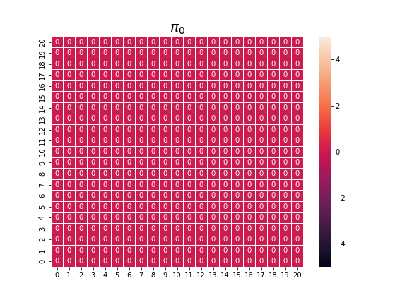
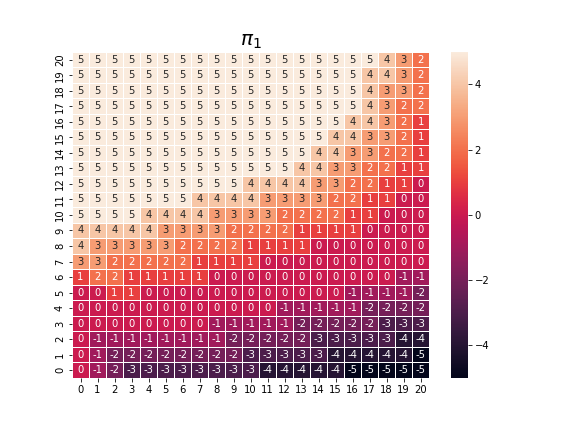
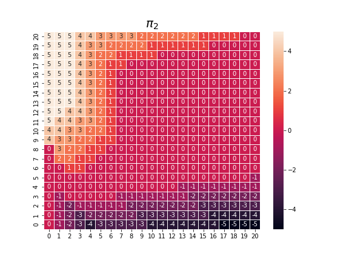
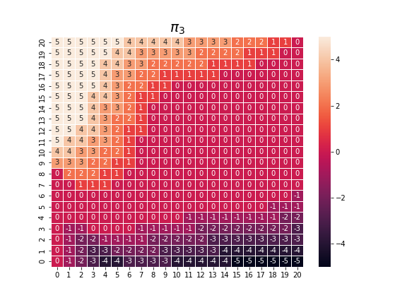

Updated problem:

$\pi_5$ is stable.

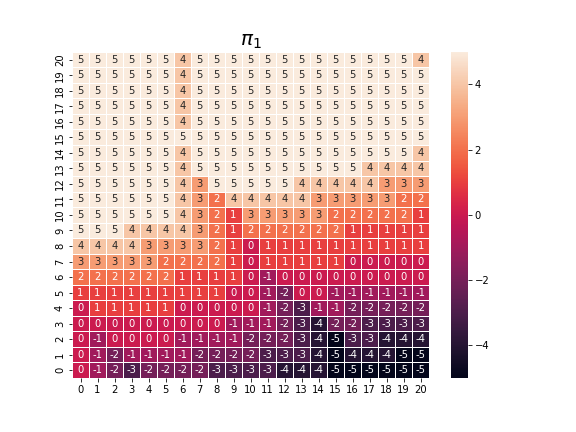
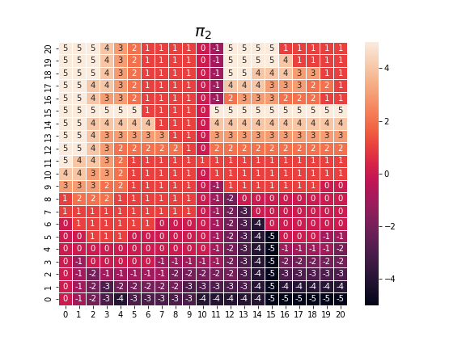
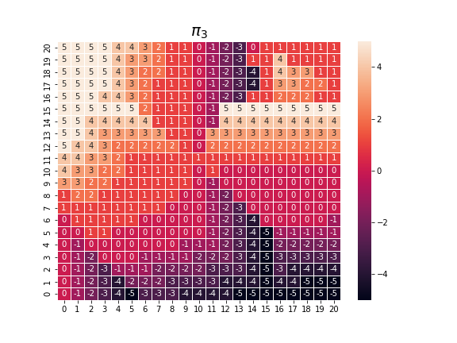

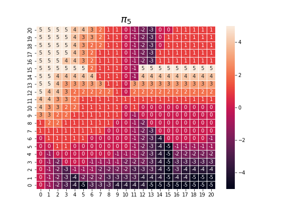

## Exercise 4.8

Why does the optimal policy for the gambler’s problem have such a curious form? In particular, for capital of 50 it bets it all on one flip, but for capital of 51 it does not. Why is this a good policy?

**My answer:**

With $p_h = 0.4$ the coin is biased against the gambler. Thus you should minimize the number of flips. With 50 capital you have exactly enough to make a bet such that if the coin comes up heads you win. With 51 you have enough to make a bet that could immediately win. However, there is also the opportunity of using the 1 extra capital to try to build up towards 75, where you could make two flips in a row that both could make you win. 25 first and then 50 if the first one fails. On the other hand, if you immediately bet 50 and lose, you can try to build up the 1 left over to 25. Building up from 1 to 25 is equally unlikely as from 51 to 75, but the former lets you make a 25 bet to get to 50 while the latter lets you make a 25 bet to win, the latter is clearly preferable.

## Exercise 4.9 (programming)

Implement value iteration for the gambler’s problem and solve it for $p_h = 0.25$ and $p_h = 0.55$. In programming, you may find it convenient to introduce two dummy states corresponding to termination with capital of 0 and 100, giving them values of 0 and 1 respectively. Show your results graphically, as in Figure 4.3. Are your results stable as $\theta \to 0$?

**My answer:**

Final policies for $p_h = 0.4$ and $p_h = 0.25$ have similar shapes with $\pi(25) = 25$, $\pi(50) = 50$, $\pi(75) = 25$. However, when looking at the final $V(s)$ it seems like estimates has prematurely converged due to precision limits in the data type (np.float64). The final policy for $p_h = 0.55$ is completely different, with $\pi(s) = 1$ for all $s$. The key difference is whether $p_h > 0.5$.

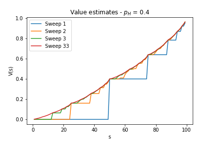
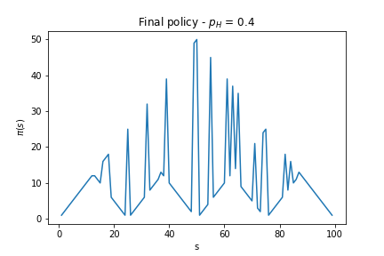

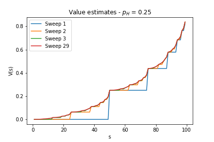
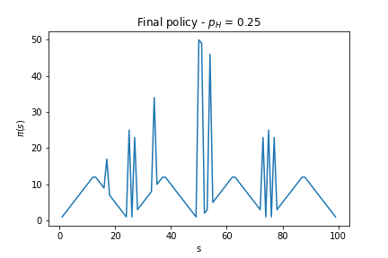

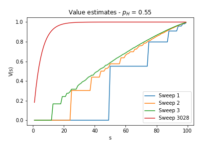
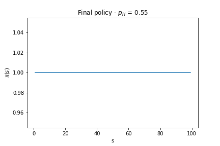

## Exercise 4.10

What is the analog of the value iteration update (4.10) for action values, $q_{k+1}(s, a)$?

**My answer:**

$$
\begin{aligned}
q_{k+1}(s, a) &= \mathbb{E}\big[R_{t+1} + \gamma \max_{a^\prime} q_k(S_{t+1}, a^\prime) | S_t = s, A_t = a \big] \\
&= \sum_{s^\prime, r} p(s^\prime, r | s, a) \big[r + \gamma \max_{a^\prime} q_k(s^\prime, a^\prime) \big]
\end{aligned}
$$
