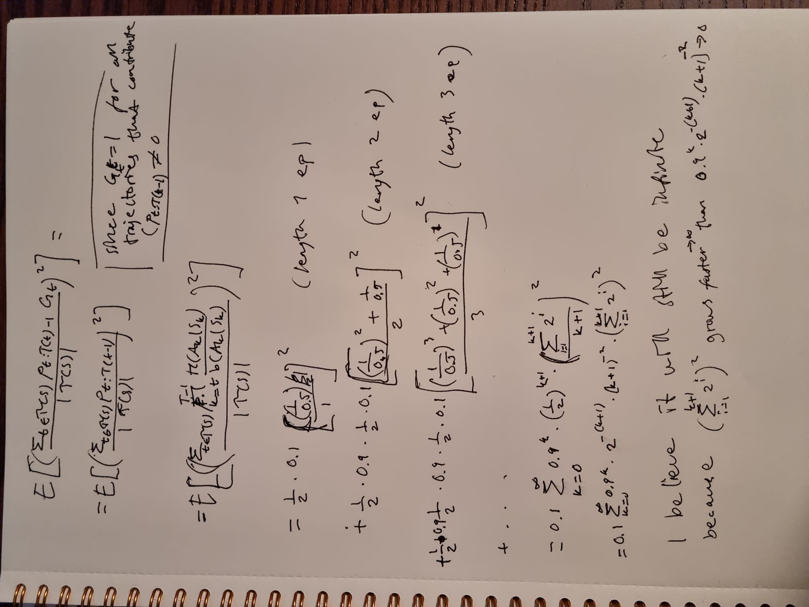
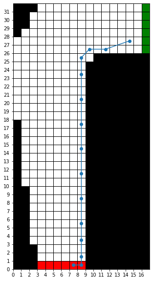

# Exercises - Chapter 5

Carl Fredriksson, c@msp.se

## Exercise 5.1

Consider the diagrams on the right in Figure 5.1. Why does the estimated value function jump up for the last two rows in the rear? Why does it drop off for the whole last row on the left? Why are the frontmost values higher in the upper diagrams than in the lower?

**My answer:**

It jumps up for the last two rows in the rear since for any other player sum the player hits and is likely to end up going bust. Additionally, 20 or 21 will often be better than what the dealer gets (and the dealer can go bust).

It drops off for the whole last row on the left since the dealer is showing an ace, which is the best first card and thus reduces the likelihood that the player wins. An ace combines with one or two 10-valued cards, which is the most common card value, to make 21, and it's flexible.

The frontmost values are higher in the upper diagrams because the player is holding a usable ace and is thus less likely to bust and more likely to get to 20 or 21.

## Exercise 5.2

Suppose every-visit MC was used instead of first-visit MC on the blackjack task. Would you expect the results to be very different? Why or why not?

**My answer:**

I would not expect the results to be different at all, since the first-visit to a state will be the only visit to that state during the episode. The same player sum might occur twice, but the first time usable ace will be true and the second time it will be false.

## Exercise 5.3

What is the backup diagram for Monte Carlo estimation of $q_\pi$?

**My answer:**

It's the same as for $v_\pi$, except that the root is a state-action pair. Below the state-action root is the entire trajectory of transitions along a particular single episode, ending at the terminal state.

## Exercise 5.4

The pseudocode for Monte Carlo ES is inefficient because, for each state–action pair, it maintains a list of all returns and repeatedly calculates their mean. It would be more efficient to use techniques similar to those explained in Section 2.4 to maintain just the mean and a count (for each state–action pair) and update them incrementally. Describe how the pseudocode would be altered to achieve this.

**My answer:**

* Remove the returns storage.
* Initialize $N(s, a) \leftarrow 0$, for all $s \in \mathcal{S}$, $a \in \mathcal{A}(s)$.
* Increment $N(s, a)$ every time the the state-action pair $(s, a)$ is visited.
* Change the $Q$-update to:

$$
Q(S_t, A_t) \leftarrow Q(S_t, A_t) + \frac{1}{N(S_t, A_t)} (G - Q(S_t, A_t))
$$

## Exercise 5.5

Consider an MDP with a single nonterminal state and a single action that transitions back to the nonterminal state with probability $p$ and transitions to the terminal state with probability $1 - p$. Let the reward be $+1$ on all transitions, and let $\gamma = 1$. Suppose you observe one episode that lasts 10 steps, with a return of 10. What are the first-visit and every-visit estimators of the value of the nonterminal state?

**My answer:**

Since there is only one action, there is only one possible policy and thus $\rho_{t:T(t)-1} = 1$ for all $t$. This means that there is no difference between the ordinary and weighted importance sampling, since $\sum_{t \in \mathcal{T}(s)} \rho_{t:T(t)-1} = |\mathcal{T}(s)|$.

First-visit:

$$
V(s) = G_0 = 10
$$

Every-visit:

$$
V(s) = \frac{G_0 + G_0 + \dots + G_{9}}{|\mathcal{T}(s)|} = \frac{10 + 9 + \dots + 1}{10} = 10 (\frac{10 + 1}{2}) = 55
$$

## Exercise 5.6

What is the equation analogous to (5.6) for action values $Q(s, a)$ instead of state values $V(s)$, again given returns generated using $b$?

**My answer:**

Let $\mathcal{T}(s, a)$ denote all time steps in which state $s$ is visited and action $a$ selected.

$$
Q(s, a) = \frac{\sum_{t \in \mathcal{T}(s, a)} \rho_{t+1:T(t)-1} G_t}{\sum_{t \in \mathcal{T}(s, a)} \rho_{t+1:T(t)-1}}
$$

## Exercise 5.7

In learning curves such as those shown in Figure 5.3 error generally decreases with training, as indeed happened for the ordinary importance-sampling method. But for the weighted importance-sampling method error first increased and then decreased. Why do you think this happened?

**My answer:**

We only have to consider trajectories consistent with the target policy, in other words trajectories where the player hits on all player sums that are not 20 or 21. This is because other trajectories have $\rho_{t+1:T(t)-1} = 0$.

I had trouble with this exercise, but I'm thinking it's due to something like this:
For the first episode, the $\rho_{t+1:T(t)-1}$ will cancel out in the numerator and denominator and thus we will simply be averaging (over runs) mean square errors for $G_t \in \{-1,0,1\}$, which will most commonly be $-1$ for all trajectories consistent with the target policy (most likely to go bust I believe). This average should be quite close to the real value. After the first episode, the bias of weighted importance-sampling is starting to show more and more until the effect of the denominator approximating $|\mathcal{T}(s)|$ takes over and eventually the methods align.

## Exercise 5.8

The results with Example 5.5 and shown in Figure 5.4 used a first-visit MC method. Suppose that instead an every-visit MC method was used on the same problem. Would the variance of the estimator still be infinite? Why or why not?

**My answer:**

## Exercise 5.9

Modify the algorithm for first-visit MC policy evaluation (Section 5.1) to use the incremental implementation for sample averages described in Section 2.4.

**My answer:**

Input: a policy $\pi$ to be evaluated
Initialize:
  * $V(s) \in \mathbb{R}$, arbitrarily for all $s \in \mathcal{S}$
  * $N(s) \leftarrow 0$ for all $s \in \mathcal{S}$
  
Loop forever (for each episode):
  * Generate an episode following $\pi: S_0, A_0, R_1, S_1, A_2, R_2, \dots, S_{T-1}, A_{T-1}, R_T$
  * $G \leftarrow 0$
  * Loop for each step of the episode, $t = T-1, T-2, \dots, 0:$
    * $G \leftarrow \gamma G + R_{t+1}$
    * Unless $S_t$ appears in $S_0, S_1, \dots, S_{t-1}:$
      * $N(S_t) \leftarrow N(S_t) + 1$
      * $V(S_t) \leftarrow V(S_t) + \frac{1}{N(S_t)} \big[G - V(S_t) \big]$

## Exercise 5.10

Derive the weighted-average update rule (5.8) from (5.7). Follow the pattern of the derivation of the unweighted rule (2.3).

**My answer:**

$$
\begin{aligned}
V_{n+1} &= \frac{\sum_{k=1}^n W_k G_k}{\sum_{k=1}^n W_k} \\
&= \frac{1}{\sum_{k=1}^n W_k} \bigg[W_n G_n + \sum_{k=1}^{n-1} W_k G_k \bigg] \\
&= \frac{1}{\sum_{k=1}^n W_k} \bigg[W_n G_n + \bigg(\sum_{k=1}^{n-1} W_k\bigg) \frac{1}{\sum_{k=1}^{n-1} W_k} \sum_{k=1}^{n-1} W_k G_k \bigg] \\
&= \frac{1}{\sum_{k=1}^n W_k} \bigg[W_n G_n + V_n \sum_{k=1}^{n-1} W_k \bigg] \\
&= \frac{1}{\sum_{k=1}^n W_k} \bigg[W_n G_n - W_n V_n + W_n V_n + V_n \sum_{k=1}^{n-1} W_k \bigg] \\
&= \frac{1}{\sum_{k=1}^n W_k} \bigg[W_n G_n - W_n V_n + V_n \sum_{k=1}^n W_k \bigg] \\
&= V_n + \frac{1}{\sum_{k=1}^n W_k} \bigg[W_n G_n - W_n V_n \bigg] \\
&= V_n + \frac{W_n}{\sum_{k=1}^n W_k} \bigg[G_n - V_n \bigg] \\
&= V_n + \frac{W_n}{C_n} \bigg[G_n - V_n \bigg] \\
\end{aligned}
$$

## Exercise 5.11

In the boxed algorithm for off-policy MC control, you may have been expecting the $W$ update to have involved the importance-sampling ratio $\frac{\pi(A_t|S_t)}{b(A_t|S_t)}$, but instead it involves $\frac{1}{b(A_t|S_t)}$. Why is this nevertheless correct?

**My answer:**

Because the target policy $\pi$ is deterministic with $\pi(A_t | S_t) = 1$ for all relevant state-action pairs, since we have the following before updating $W$:

> If $A_t \neq \pi(S_t)$ then exit inner Loop (proceed to next episode)

## Exercise 5.12: Racetrack (programming)

Consider driving a race car around a turn like those shown in Figure 5.5. You want to go as fast as possible, but not so fast as to run off the track. In our simplified racetrack, the car is at one of a discrete set of grid positions, the cells in the diagram. The velocity is also discrete, a number of grid cells moved horizontally and vertically per time step. The actions are increments to the velocity components. Each may be changed by +1, -1, or 0 in each step, for a total of nine (3 x 3) actions. Both velocity components are restricted to be nonnegative and less than 5, and they cannot both be zero except at the starting line. Each episode begins in one of the randomly selected start states with both velocity components zero and ends when the car crosses the finish line. The rewards are -1 for each step until the car crosses the finish line. If the car hits the track boundary, it is moved back to a random position on the starting line, both velocity components are reduced to zero, and the episode continues. Before updating the car's location at each time step, check to see if the projected path of the car intersects the track boundary. If it intersects the finish line, the episode ends; if it intersects anywhere else, the car is considered to have hit the track boundary and is sent back to the starting line. To make the task more challenging, with probability 0.1 at each time step the velocity increments are both zero, independently of the intended increments. Apply a Monte Carlo control method to this task to compute the optimal policy from each starting state. Exhibit several trajectories following the optimal policy (but turn the noise off for these trajectories).

**My answer:**

I got the best results using on-policy every-visit MC control using $\epsilon$-greedy policies with $\epsilon$ decreasing over time, and using a constant learning rate of 0.1 rather than using sample averages. The policy is not optimal after learning for a million episodes, but it's pretty good - see trajectories below.

## Exercise 5.13

Show the steps to derive (5.14) from (5.12).

**My answer:**

$$
\begin{aligned}
\mathbb{E}[\rho_{t:T-1} R_{t+1}] &= \mathbb{E}\bigg[\frac{\pi(A_t | S_t)}{b(A_t | S_t)} \frac{\pi(A_{t+1} | S_{t+1})}{b(A_{t+1} | S_{t+1})} \frac{\pi(A_{t+2} | S_{t+2})}{b(A_{t+2} | S_{t+2})} \dots \frac{\pi(A_{T-1} | S_{T-1})}{b(A_{T-1} | S_{T-1})} R_{T-1} \bigg] \\
&= \mathbb{E}\bigg[\frac{\pi(A_t | S_t)}{b(A_t | S_t)} R_{t+1} \bigg] \mathbb{E}\bigg[\frac{\pi(A_{t+1} | S_{t+1})}{b(A_{t+1} | S_{t+1})} \bigg] \mathbb{E}\bigg[\frac{\pi(A_{t+2} | S_{t+2})}{b(A_{t+2} | S_{t+2})}\bigg] \dots \mathbb{E}\bigg[\frac{\pi(A_{T-1} | S_{T-1})}{b(A_{T-1} | S_{T-1})} \bigg] \\

&= \mathbb{E}\bigg[\frac{\pi(A_t | S_t)}{b(A_t | S_t)} R_{t+1} \bigg] \\
&= \mathbb{E}\bigg[\rho_{t:t} R_{t+1} \bigg] \\
\end{aligned}
$$

The second equality is due to $A_t | S_t, A_{t+1} | S_{t+1}, \dots A_{T-1} | S_{T-1}$ being independent random variables. The third equality is due to (5.13).

## Exercise 5.14

Modify the algorithm for off-policy Monte Carlo control (page 111) to use the idea of the truncated weighted-average estimator (5.10). Note that you will first need to convert this equation to action values.

**My answer:**

I believe this would work (but there are many optimizations that can be made):

Initialize, for all $s \in \mathcal{S}, a \in \mathcal{A}(s)$:
  * $Q(s, a) \in \mathbb{R}$ (arbitrarily)
  * $\pi(s) \leftarrow \argmax_a Q(s, a)$ (with ties broken consistently) 
  * $Numerator(s, a) \leftarrow 0$
  * $Denominator(s, a) \leftarrow 0$
  
Loop forever (for each episode):
  * $b \leftarrow$ any soft policy
  * Generate an episode following $b: S_0, A_0, R_1, S_1, A_2, R_2, \dots, S_{T-1}, A_{T-1}, R_T$
  * Loop for each step of the episode, $t = T-1, T-2, \dots, 0:$
    * $Num \leftarrow (1 - \gamma) \sum_{h=t+1}^{T(t)-1} \gamma^{h-t-1} \rho_{t:h-1} \bar{G}_{t:h} + \gamma^{T(t)-t-1} \rho_{t:T(t)-1} \bar{G}_{t:T(t)}$
    * $Den \leftarrow (1 - \gamma) \sum_{h=t+1}^{T(t)-1} \gamma^{h-t-1} \rho_{t:h-1} + \gamma^{T(t)-t-1} \rho_{t:T(t)-1}$
    * $Numerator(S_t, A_t) \leftarrow Numerator(S_t, A_t) + Num$
    * $Denominator(S_t, A_t) \leftarrow Denominator(S_t, A_t) + Den$
    * $Q(S_t, A_t) \leftarrow \frac{Numerator(S_t, A_t)}{Denominator(S_t, A_t)}$
    * $\pi(S_t) \leftarrow \argmax_a Q(S_t, a)$ (with ties broken consistently)
    * If $A_t \neq \pi(S_t)$ then exit inner Loop (proceed to next episode)

## Exercise 5.15

Make new equations analogous to the importance-sampling Monte Carlo estimates (5.5) and (5.6), but for action value estimates Q(s, a). You will need new notation T(s, a) for the time steps on which the state–action pair s, a is visited on the episode. Do these estimates involve more or less importance-sampling correction?

**My answer:**

