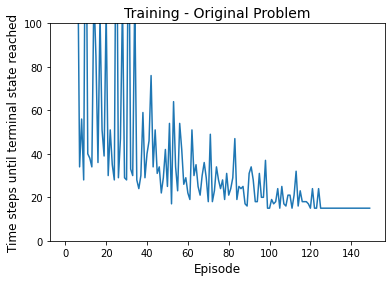
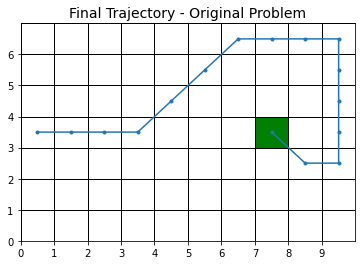
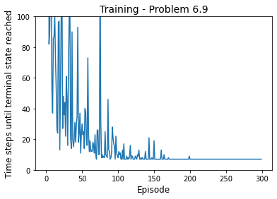
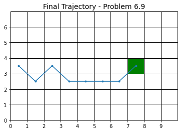
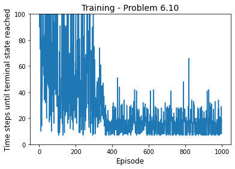
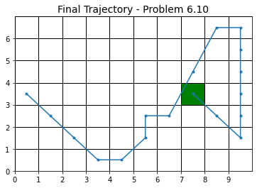

# Exercises - Chapter 6

Carl Fredriksson, c@msp.se

## Exercise 6.1

If $V$ changes during the episode, then (6.6) only holds approximately; what would the difference be between the two sides? Let $V_t$ denote the array of state values used at time $t$ in the TD error (6.5) and in the TD update (6.2). Redo the derivation above to determine the additional amount that must be added to the sum of TD errors in order to equal the Monte Carlo error.

**My answer:**

$$
\begin{aligned}
G_t - V_t(S_t) &= R_{t+1} + \gamma G_{t+1} - V_t(S_t) + \gamma V_t(S_{t+1}) - \gamma V_t(S_{t+1}) \\
&= \delta_t + \gamma \big[G_{t+1} - V_t(S_{t+1}) \big] \\
&= \delta_t + \gamma \big[G_{t+1} - V_t(S_{t+1}) + V_{t+1}(S_{t+1}) - V_{t+1}(S_{t+1}) \big] \\
&= \delta_t + \gamma \big[G_{t+1} - V_{t+1}(S_{t+1}) \big] + \gamma \big[V_{t+1}(S_{t+1}) - V_t(S_{t+1}) \big] \\
&= \delta_t + \gamma \delta_{t+1} + \gamma \big[V_{t+1}(S_{t+1}) - V_t(S_{t+1}) \big] + \gamma^2 \big[G_{t+2} - V_{t+1}(S_{t+2}) \big] \\
&= \delta_t + \gamma \delta_{t+1} + \gamma \big[V_{t+1}(S_{t+1}) - V_t(S_{t+1}) \big] + \gamma^2 \delta_{t+2} + \gamma^2 \big[V_{t+2}(S_{t+2}) - V_{t+1}(S_{t+2}) \big] + \\ &\quad \dots + \gamma^{T-t-1} \delta_{T-1} + \gamma^{T-t-1} \big[V_{T-1}(S_{T-1}) - V_{T-2}(S_{T-1}) \big] + \gamma^{T-t} \big[G_T - V_{T-1}(S_{T}) \big] \\
&= \delta_t + \gamma \delta_{t+1} + \gamma \big[V_{t+1}(S_{t+1}) - V_t(S_{t+1}) \big] + \gamma^2 \delta_{t+2} + \gamma^2 \big[V_{t+2}(S_{t+2}) - V_{t+1}(S_{t+2}) \big] + \\ &\quad \dots + \gamma^{T-t-1} \delta_{T-1} + \gamma^{T-t-1} \big[V_{T-1}(S_{T-1}) - V_{T-2}(S_{T-1}) \big] + \gamma^{T-t} \big[0 - 0 \big] \\
&= \sum_{k=t}^{T-1} \gamma^{k-t} \delta_k + \sum_{k=t}^{T-1} \gamma^{k-t+1} \big[V_{k+1}(S_{k+1}) - V_k(S_{k+1}) \big] 
\end{aligned}
$$

Thus the additional amount that must be added is:

$$
\sum_{k=t}^{T-1} \gamma^{k-t+1} \big[V_{k+1}(S_{k+1}) - V_k(S_{k+1}) \big] 
$$

## Exercise 6.2

This is an exercise to help develop your intuition about why TD methods are often more efficient than Monte Carlo methods. Consider the driving home example and how it is addressed by TD and Monte Carlo methods. Can you imagine a scenario in which a TD update would be better on average than a Monte Carlo update? Give an example scenario—a description of past experience and a current state—in which you would expect the TD update to be better. Here's a hint: Suppose you have lots of experience driving home from work. Then you move to a new building and a new parking lot (but you still enter the highway at the same place). Now you are starting to learn predictions for the new building. Can you see why TD updates are likely to be much better, at least initially, in this case? Might the same sort of thing happen in the original scenario?

**My answer:**

I was confused by this exercise before receiving the solutions. "Then you move to a new building and a new parking lot" - refers to moving office building, not moving to a new apartment building (you drive to the same home).

TD updates are likely to be much better in the hint-scenario because they bootstrap. They can utilize the accurate estimates of travel times after entering the highway that have already been built on lots of experience. While Monte Carlo methods will be fully affected by variance over the whole journey, TD methods will be much less affected by variance in the part after the highway. This is because Monte Carlo updates use all observed rewards until the episode is terminated, while TD methods only use immediate reward together with an estimate of the next state's value (for the later part of the journey only the immediate rewards would be noisy since the value estimates should be very accurate).

The same sort of thing could happen in the original problem as well. Especially if a state can be reached in different ways, from different trajectories. When you come across a familiar state from a new direction, a TD method enables you to take advantage of what you have learned about the state along other trajectories. For example, if there is a traffic jam or construction on your usual route that forces you to enter the highway at a different point, the experience from the highway onwards can be utilized.

## Exercise 6.3

From the results shown in the left graph of the random walk example it appears that the first episode results in a change in only $V(A)$. What does this tell you about what happened on the first episode? Why was only the estimate for this one state changed? By exactly how much was it changed?

**My answer:**

The first episode terminated on the left side. Only $V(A)$ was changed since the TD error was 0 for all other states:

$$
\delta_t = R_{t+1} + \gamma V(S_{t+1}) - V(S_t) = 0 + 0.5 - 0.5 = 0
$$

$$
V(S_t) \leftarrow V(S_t) + \alpha [R_{t+1} + \gamma V(S_{t+1}) - V(S_t)] = 0.5 + 0.1 \cdot 0 = 0.5
$$

The TD error for $t = T-1$ where $S_t = A$:

$$
\delta_t = R_{t+1} + \gamma V(S_{t+1}) - V(S_t) = R_T + \gamma V(S_T) - V(A) = 0 + 0 - 0.5 = -0.5
$$

Thus we have only one relevant update:

$$
V(A) \leftarrow V(A) + \alpha [R_T + \gamma V(S_T) - V(A)] = 0.5 + 0.1 (-0.5) = 0.45
$$

The estimate for $V(A)$ was changed by -0.05.

## Exercise 6.4

The specific results shown in the right graph of the random walk example are dependent on the value of the step-size parameter, $\alpha$. Do you think the conclusions about which algorithm is better would be affected if a wider range of $\alpha$ values were used? Is there a different, fixed value of $\alpha$ at which either algorithm would have performed significantly better than shown? Why or why not?

**My answer:**

With $\alpha = 0$, both algorithms would be stuck with the initial estimates (but 0 is probably not in the set of possible values for $\alpha$).

I don't think there is a fixed value of $\alpha$ at which either algorithm would have performed significantly better than shown. With larger $\alpha$, the algorithms initially learn quicker, but will stop improving quicker compared to smaller $\alpha$, due to larger indefinite fluctuations. In order to significantly improve, I believe that we need a dynamic $\alpha$ that starts of large in order to quickly learn better estimates than the initial estimates, but gets smaller over time and eventually reaches 0 in order to remove the indefinite fluctuations.

## Exercise 6.5

In the right graph of the random walk example, the RMS error of the TD method seems to go down and then up again, particularly at high $\alpha$’s. What could have caused this? Do you think this always occurs, or might it be a function of how the approximate value function was initialized?

**My answer:**

The value estimates other than $V(C)$ will quickly improve in the beginning due their initializations differing significantly from their true values. However, the estimates will never converge to their true values due to the recency bias caused by the fixed value $\alpha$.

It will take some episodes before $V(C)$ starts to get updated, and when it does it will become a worse estimate. Due to initializing all estimates to 0.5, which is the true value for $V(C) = v_\pi(C) = 0.5$, it can't become a better estimate. It will move towards $V(B)$ in some updates and towards $V(D)$ in others.

Thus I believe it might be a function of how the approximate value function (the value estimates) was initialized.

## Exercise 6.6

In Example 6.2 we stated that the true values for the random walk example are $\frac{1}{6}$, $\frac{2}{6}$, $\frac{3}{6}$, $\frac{4}{6}$, $\frac{5}{6}$, $\frac{1}{6}$, for states $A$ through $E$. Describe at least two different ways that these could have been computed. Which would you guess we actually used? Why?

**My answer:**

On option is to use Monte Carlo prediction with sample averaging (first-visit or every-visit), which will converge to the true values $v_\pi$ (unlike using a fixed value $\alpha$). However, convergence is only guaranteed in the limit.

A better option is to use value/policy iteration from dynamic programming. However, this requires specifying the dynamics function of the problem.

Since the state space is so small and the dynamics so simple, I believe the best method (and probably the one the authors used) is to simply solve the Bellman equation:

$$
v_\pi(s) = \sum_{a \in \mathcal{A}(s)} \pi(a | s) \sum_{s^\prime, r} p(s^\prime, r | s, a) \big[r + \gamma v_\pi(s^\prime) \big], \quad \text{for all} \; s \in \mathcal{S}
$$

Since it's a Markov reward process (an MDP without actions), we can simplify:

$$
v_\pi(s) = \sum_{s^\prime, r} p(s^\prime, r | s) \big[r + \gamma v_\pi(s^\prime) \big], \quad \text{for all} \; s \in \mathcal{S}
$$

Inputting the dynamics of the problem, we end up with the following system of linear equations:

$$
\begin{aligned}
v_\pi(A) &= \frac{1}{2} v_\pi(B) \\
v_\pi(B) &= \frac{1}{2} v_\pi(A) + \frac{1}{2} v_\pi(C) \\
v_\pi(C) &= \frac{1}{2} v_\pi(B) + \frac{1}{2} v_\pi(D) \\
v_\pi(D) &= \frac{1}{2} v_\pi(C) + \frac{1}{2} v_\pi(E) \\
v_\pi(E) &= \frac{1}{2} v_\pi(D) + \frac{1}{2} \\
\end{aligned}
$$

which can easily be solved by hand.

## Exercise 6.7

Design an off-policy version of the TD(0) update that can be used with arbitrary target policy $\pi$ and covering behavior policy $b$, using at each step $t$ the importance sampling ratio $\rho_{t:t}$ (5.3).

**My answer:**

$$
V(S_t) \leftarrow V(S_t) + \alpha \rho_{t:t} [R_{t+1} + \gamma V(S_{t+1}) - V(S_t)]
$$

where

$$
\rho_{t:t} = \frac{\pi(A_t | S_t)}{b(A_t | S_t)}
$$

## Exercise 6.8

Show that an action-value version of (6.6) holds for the action-value form of the TD error $\delta_t = R_{t+1} + Q(S_{t+1}, A_{t+1}) - Q(S_t, A_t)$, again assuming that the values don't change from step to step.

**My answer:**

$$
\begin{aligned}
G_t - Q(S_t, A_t) &= R_{t+1} + \gamma G_{t+1} - Q(S_t, A_t) + \gamma Q(S_{t+1}, A_{t+1}) - \gamma Q(S_{t+1}, A_{t+1}) \\
&= \delta_t + \gamma \big[G_{t+1} - Q(S_{t+1}, A_{t+1}) \big] \\
&= \delta_t + \gamma \delta_{t+1} + \gamma^2 \big[G_{t+2} - Q(S_{t+2}, A_{t+2}) \big] \\
&= \delta_t + \gamma \delta_{t+1} + \gamma^2 \delta_{t+2} + \dots + \gamma^{T-t-1} \delta_{T-1} + \gamma^{T-t} \big[G_T - Q(S_T, A_T) \big] \\
&= \delta_t + \gamma \delta_{t+1} + \gamma^2 \delta_{t+2} + \dots + \gamma^{T-t-1} \delta_{T-1} + \gamma^{T-t} \big[0 - 0 \big] \\
&= \sum_{k=t}^{T-1} \gamma^{k-t} \delta_k
\end{aligned}
$$

## Exercise 6.9: Windy Gridworld with King’s Moves (programming)

Re-solve the windy gridworld assuming eight possible actions, including the diagonal moves, rather than four. How much better can you do with the extra actions? Can you do even better by including a ninth action that causes no movement at all other than that caused by the wind?

**My answer:**

I started by solving the original problem:

Below are the results when diagonal moves are included, note that there are multiple optimal trajectories. The optimal trajectories are of length 7, much shorter than the 15 in the original problem. It's not possible to do better by including a ninth action that causes no movement at all other than that caused by the wind, because the wind only moves upwards and trajectories of length 7 are the shortest possible when moving at most 1 cell horizontally per step.

## Exercise 6.10: Stochastic Wind (programming)

Re-solve the windy gridworld task with King's moves, assuming that the effect of the wind, if there is any, is stochastic, sometimes varying by 1 from the mean values given for each column. That is, a third of the time you move exactly according to these values, as in the previous exercise, but also a third of the time you move one cell above that, and another third of the time you move one cell below that. For example, if you are one cell to the right of the goal and you move left, then one-third of the time you move one cell above the goal, one-third of the time you move two cells above the goal, and one-third of the time you move to the goal.

**My answer:**

Stochastic wind makes the problem significantly harder. The agent probably did not learn an optimal policy, but the final trajectory looks pretty good considering the stochasticity.

## Exercise 6.11

Why is Q-learning considered an off-policy control method?

**My answer:**

Because the method improves a policy different from that used to generate the data. It has a behavior policy $b$ that determines action selection during learning, and a target policy $\pi$ that the agent improves over time. The behavior policy is derived from $Q$, but needs to make the agent explore, for example by being $\epsilon$-greedy with regards to $Q$. The target policy is greedy with regards to $Q$.

## Exercise 6.12

Suppose action selection is greedy. Is Q-learning then exactly the same algorithm as Sarsa? Will they make exactly the same action selections and weight
updates?

**My answer:**

If both Sarsa and Q-learning use greedy action selection they are the same algorithm and will make the exact same action selections and weight updates.

## Exercise 6.13

What are the update equations for Double Expected Sarsa with an $\epsilon$-greedy target policy?

**My answer:**

* Algorithm parameters: step size $\alpha \in (0,1]$, small $\epsilon > 0$
* Initialize $Q_1(s,a)$ and $Q_2(s,a)$, for all $s \in \mathcal{S}^+$, $a \in \mathcal{A}(s)$, such that $Q(terminal,\cdot) = 0$
* Loop for each episode:
  * Initialize $S$
  * Loop for each step of episode:
    * Choose $A$ from $S$ using the policy $\epsilon$-greedy in $Q_1 + Q_2$
    * Take action $A$, observe $R$, $S^\prime$
    * With 0.5 probability:
      * $Q_1(S,A) \leftarrow Q_1(S,A) + \alpha \big[R + \gamma \sum_a \pi(a|S_{t+1}) Q_2(S^\prime,a) - Q_1(S,A) \big]$
    * else:
      * $Q_2(S,A) \leftarrow Q_2(S,A) + \alpha \big[R + \gamma \sum_a \pi(a|S_{t+1}) Q_1(S^\prime,a) - Q_2(S,A) \big]$
    * $S \leftarrow S^\prime$
  * until $S$ is terminal

## Exercise 6.14

Describe how the task of Jack's Car Rental (Example 4.2) could be reformulated in terms of afterstates. Why, in terms of this specific task, would such a reformulation be likely to speed convergence?

**My answer:**

The original formulation defines states as the number of cars at each location at the end of the day, and actions as the number of cars moved between the two locations overnight. Since the overnight car moving is completely deterministic, we can reformulate the task using afterstates, defined as the number of cars at each location after the overnight moves. This is likely to speed up convergence due to removing the need to waste computations on state-action pairs that, except for the deterministic cost difference of moving different number of cars, are functionally identical. As an example, let's say that we have 4 cars at location A and 1 car at location B at the end of the day. We move 1 car from A to B, ending up with 3 and 2 respectively. This would affect the immediate reward by -2\$. Let's instead say that we have 5 cars at location A and 0 cars at location B at the end of the day. We move 2 cars from A to B, again ending up with 3 and 2 respectively. This time the immediate reward is affected by -4\$ since an additional car was moved. However, the expected future return from the next state would be the same since both state-action pairs deterministically result in (3, 2) before any probabilistic dynamics come into play.

<!--
The original formulation defines states as the number of cars at each location at the end of the day, and actions as the number of cars moved between the two locations overnight. Note that the overnight car moving is completely deterministic, and probabilistic dynamics start when the the business opens the next morning. I was initially trying to define afterstates as the number of cars at each location after the overnight moves - since this is all that matters for the expected future return. However, I couldn't figure out how to handle 
-->

The evaluation update in policy iteration could look something like this:

$$
V(z) \leftarrow \sum_{s^\prime} p(s^\prime|z) \bigg(r(s^\prime|z) + \pi(z^\prime|s^\prime) \big[r_{cost}(s^\prime,z^\prime) + \gamma V(z^\prime)\big]\bigg)
$$
