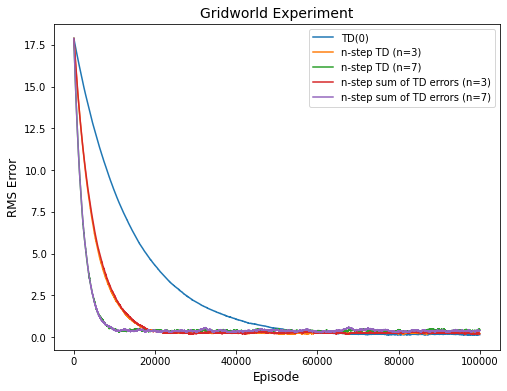

# Exercises - Chapter 7

Carl Fredriksson, c@msp.se

## Exercise 7.1

In Chapter 6 we noted that the Monte Carlo error can be written as the sum of TD errors (6.6) if the value estimates don't change from step to step. Show that the n-step error used in (7.2) can also be written as a sum of TD errors (again if the value estimates don't change) generalizing the earlier result.

**My answer:**

$$
\begin{aligned}
G_{t:t+n} - V(S_t) &= R_{t+1} + \gamma G_{t+1:t+n} - V(S_t) + \gamma V(S_{t+1}) - \gamma V(S_{t+1}) \\
&= \delta_t + \gamma \big[G_{t+1:t+n} - V(S_{t+1}) \big] \\
&= \delta_t + \gamma \delta_{t+1} + \gamma^2 \big[G_{t+2:t+n} - V(S_{t+2}) \big]  \\ 
&= \delta_t + \gamma \delta_{t+1} + \gamma^2 \delta_{t+2} + \dots + \gamma^{n-1} \big[G_{t+n-1:t+n} - V(S_{t+n-1}) \big] \\
&= \delta_t + \gamma \delta_{t+1} + \gamma^2 \delta_{t+2} + \dots + \gamma^{n-1} \big[R_{t+n} + \gamma V(S_{t+n}) - V(S_{t+n-1}) \big] \\
&= \delta_t + \gamma \delta_{t+1} + \gamma^2 \delta_{t+2} + \dots + \gamma^{n-1} \delta_{t+n-1} \\
&= \sum_{k=t}^{t+n-1} \gamma^{k-t} \delta_k
\end{aligned}
$$

## Exercise 7.2 (programming)

With an n-step method, the value estimates do change from step to step, so an algorithm that used the sum of TD errors (see previous exercise) in place of the error in (7.2) would actually be a slightly different algorithm. Would it be a better algorithm or a worse one? Devise and program a small experiment to answer this question empirically.

**My answer:**

I programmed an experiment using the 4x4 gridworld in Example 4.1. There was a big difference in convergence speed when comparing the n-step methods to TD(0). However, I did not see any significant difference between n-step TD and n-step sum of TD errors. A constant step size of $\alpha = 0.001$ was used for all algorithms and the results were averaged over 10 runs per algorithm.

## Exercise 7.3

Why do you think a larger random walk task (19 states instead of 5) was used in the examples of this chapter? Would a smaller walk have shifted the advantage to a different value of $n$? How about the change in left-side outcome from 0 to 1 made in the larger walk? Do you think that made any difference in the best value of $n$?

**My answer:**

I think 19 states was used instead of 5 in order to enable more $n$ values that are reasonable. When $t+n \geq T$ for most time steps $t$, then n-step TD will resemble a Monte Carlo method, since:
> If $t+n \geq T$ (if the n-step return extends to or beyond termination), then all the missing terms are taken as zero, and the n-step return defined to be equal to the ordinary full return ($G_{t:t+n} = G_t$ if $t+n \geq T$).
 
I think a smaller walk would have shifted the advantage to smaller values of $n$, since it seems like intermediate values of $n$ work best on this task. As mentioned above, the larger $n$ is compared to the size of the walk, the closer the method will be to the Monte Carlo extreme. Trajectories that start of to the right before eventually terminating to the left, and vice versa, are more likely to move some of the value estimates the wrong direction with larger values of $n$.

I think changing the left-side outcome from 0 to -1 was made to make terminating to the left immediately meaningful. Otherwise, with initializing all values to 0, initial trajectories terminating to the left would result in no update.

I think changing from 0 to -1 penalizes larger values of $n$, because:
* More updates will use ordinary full returns without bootstrapping - and ordinary full returns from trajectories terminating to the left would increase variance more with -1.
* As mentioned above, trajectories that start of to the right before eventually terminating to the left, and vice versa, are more likely to move some of the value estimates the wrong direction with larger values of $n$ - this would be more consequential with -1.
