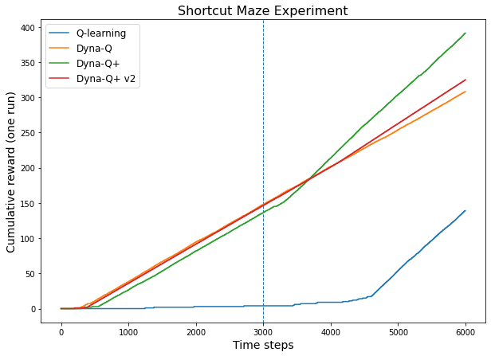
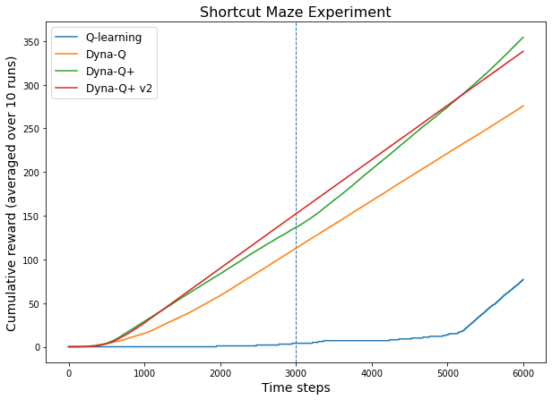

# Exercises - Chapter 8

Carl Fredriksson, c@msp.se

## Exercise 8.1

The non-planning method looks particularly poor in Figure 8.3 because it is a one-step method; a method using multi-step bootstrapping would do better. Do you think one of the multi-step bootstrapping methods from Chapter 7 could do as well as the Dyna method? Explain why or why not.

**My answer:**

If by doing well we refer to finding a complete optimal policy in the least number of episodes, then I don't think the multi-step bootstrapping methods from Chapter 7 could do as well as the Dyna method. With $n=50$ a complete optimal policy is found after 3 episodes, and with larger $n$ the algorithm might do even better. I don't think any of the multi-step bootstrapping methods are likely to find a complete optimal policy in 3 episodes. If we use many steps per update (large $n$ in the $n$-step method sense), maybe even going all the way to Monte-Carlo and using all steps in the episode, we would quickly start doing updates in each state. However, many of these updates will not move the policy efficiently towards optimality. Imagine the chaotic first episode of about 1700 steps and assume that all action-values were initialized to 0 and a large $n$ was used. Many sub-optimal actions were taken in many states, yet many of these will be the new greedy actions after the first episode. If we instead use a small $n$, the starting state and other states to the left in the grid are unlikely to be meaningfully updated in the first few episodes and it seems very unlikely that we find a complete optimal policy in 3 episodes.

If by doing well we instead refer to something like finding a complete optimal policy in the shortest clock time or least number of computer instructions, I think it could be more competitive between Dyna and the multi-step bootstrapping methods.

## Exercise 8.2

Why did the Dyna agent with exploration bonus, Dyna-Q+, perform better in the first phase as well as in the second phase of the blocking and shortcut experiments?

**My answer:**

The increased exploration made Dyna-Q+ find an optimal policy quicker (while still continuing to explore - which is why line is not completely straight). Less exploration can lead to exploitation of sub-par policies for longer.

## Exercise 8.3

Careful inspection of Figure 8.5 reveals that the difference between Dyna-Q+ and Dyna-Q narrowed slightly over the first part of the experiment. What is the reason for this?

**My answer:**

It took longer for Dyna-Q to find an optimal policy. However, once it was found it exploited that policy to a greater extent than Dyna-Q+, due to less exploration, and started accumulating reward at a slightly faster rate and thus would slowly catch up in cumulative reward. When the environment changed and only Dyna-Q+ found the new faster path, the difference in cumulative reward started growing in the favor of Dyna-Q+.

## Exercise 8.4 (programming)

The exploration bonus described above actually changes the estimated values of states and actions. Is this necessary? Suppose the bonus $\kappa \sqrt{\tau}$ was used not in updates, but solely in action selection. That is, suppose the action selected was always that for which $Q(S_t, a) + \kappa \sqrt{\tau(S_t,a)}$ was maximal. Carry out a gridworld experiment that tests and illustrates the strengths and weaknesses of this alternate approach.

**My answer:**

I used the same shortcut maze problem as in Example 8.3. It seems like the alternate approach to Dyna-Q+ (Dyna-Q+ v2 in the plot), performed better on the problem before the shortcut opened, but worse after. 

Below is a plot where the algorithms were run one time each. It seems like Dyna-Q+ v2 started to find the shortcut slower than Dyna-Q+ and didn't exploit it as well when found.

Below is a plot where the cumulative reward was averaged over 10 runs per algorithm. Averaging over multiple runs provides a fairer comparison since performance varies between runs.

Note that the methods were highly sensitive to parameter settings and the shown results are simply from one set of parameter settings. Thus I find it hard to make strong statements regarding strengths and weaknesses of the alternative approach to Dyna-Q+.

## Exercise 8.5

How might the tabular Dyna-Q algorithm shown on page 164 be modified to handle stochastic environments? How might this modification perform poorly on changing environments such as considered in this section? How could the algorithm be modified to handle stochastic environments *and* changing environments?

**My answer:**

To handle stochastic environments we could change to model to be a distribution over all experienced reward and next state pairs $(R_{t+1}, S_{t+1})$. For example, the model for state $s$ and action $a$ could be updated as follows:

* $Model(s,a) \leftarrow \{1: (r_1, s_1)\}$
* $Model(s,a) \leftarrow \{\frac{1}{2}: (r_1, s_1), \frac{1}{2}: (r_2, s_2)\}$
* $Model(s,a) \leftarrow \{\frac{2}{3}: (r_1, s_1), \frac{1}{3}: (r_2, s_2)\}$

with the left side of the ":" denoting the probability of observing the reward and next state pair in the parenthesis. In this example, $(r_1, s_1)$ was first observed after taking action $a$ in $s$, then $(r_2, s_2)$, and then $(r_1, s_1)$ again. In the planning stage we could sample from the model distribution we have created or use expected updates.

This method would handle changing environment poorly, due to that it could take a long time until the model has been sufficiently updated to reflect the change (unlike the original algorithm on page 164 that completely changes the model for the taken state-action pair after every experience).

To handle both stochastic environments and changing environments, one could have a model with a distribution, but weigh recent experience stronger in order for the model to adapt quicker to changes.

## Exercise 8.6

The analysis above assumed that all of the $b$ possible next states were equally likely to occur. Suppose instead that the distribution was highly skewed, that some of the $b$ states were much more likely to occur than most. Would this strengthen or weaken the case for sample updates over expected updates? Support your answer.

**My answer:**

I think that this would strengthen the case for sample updates over expected updates. The $b$ states (successor states) that are more likely to occur are more important for the updates. As an example, let's assume that we have two different successor states $s^\prime_1, s^\prime_2$ with respective probabilities of 0.99 and 0.01 to occur after taking action $a$ in state $s$. The latter will have almost no impact on the expected update (unless it's coupled with a relatively massive immediate reward).

$$
\begin{aligned}
Q(s,a) &\leftarrow \sum_{s^\prime,r} \hat{p}(s^\prime,r|s,a) \big[r + \gamma \max_{a^\prime} Q(s^\prime,a^\prime)\big] \\
&= \sum_r \hat{p}(r|s,a) r + \sum_{s^\prime} \hat{p}(s^\prime|s,a) \gamma \max_{a^\prime} 
Q(s^\prime,a^\prime) \\
&= r(s,a) + 0.99 \gamma \max_{a^\prime} 
Q(s^\prime_1,a^\prime) + 0.01 \gamma \max_{a^\prime} 
Q(s^\prime_2,a^\prime)
\end{aligned}
$$

Sample updates will be more likely to work with important samples, while expected updates will be unaffected. A way of thinking about it is that expected updates will waste computations on the less important successor states. In general, the less likely states are of occurring the worse the cost-benefit ratio will be for their part in expected updates since the computational cost stays the same.
